---

# 📑 Indíces

- [⚠️ Informações importantes ⚠️](#️-informações-importantes-️)
- [🚀 Tecnologias utilizadas 🚀](#-tecnologias-utilizadas)
    - [📖 Falando um pouco sobre o projeto 📖](#-falando-um-pouco-sobre-o-projeto)
---
# ⚠️ Informações importantes ⚠️

```
Linguagem: PT-Brasil
Modo: Portfólio
Criador: Luiz Fellipe Moreschi de Lima
Descrição: Projeto foi criado, para fins, de, que o cliente pudesse ter uma plataforma de freelancer.
Esse trabalho, foi desenvolvido por mim, onde, eu tive meses de trabalho árduo como freelancer. 
Logo, essas imagens, não contem as lógicas de negócios, por ética.  
```
---

# 🚀 Tecnologias utilizadas

- **Java** ➡︎ *Linguagem robusta, OOP, com foco em aplicações mais seguras e alto desempenho.*
- **Quarkus** ➡︎ *Framework Java moderno, otimizado para microsserviços e aplicações em nuvem, com foco em lógica centralizada e criação de APIs REST seguras.*
- **Docker** ➡︎ *.**Plataforma** de código aberto que permite criar, rodar e gerenciar contêineres, facilitando a implementação de aplicações de forma mais segura, portátil e eficiente na infraestrutura.*
- **MongoDB** ➡︎ *Banco de dados **NoSQL** orientado a documentos, projetado para ser flexível e escalável. Diferente dos bancos relacionais, o **MongoDB** armazena dados em coleções de documentos **JSON**, permitindo maior adaptação a diferentes tipos de aplicações.*

---

## 📖 Falando um pouco sobre o projeto

Esse projeto, foi criado para fins de assemelhar a platáformas como **99Freelas**, **Workana**, entre outras.
Foram 3 meses de desenvolvimento do backend, aplicando boas práticas de engenharia de software, como... **Layered Architeture**, **Separation of Concerns (SoC)** e **Modelling Patterns**. A construção foi feita em **Java**, usando o Quarkus como **Framework**, o **MongoDB** para armazenamento dos dados, de forma leve e facilitando a escabilidade.

---

# APIs Rest

---

## 📦 api/  
- Responsável pela integração com o **gateway da PagSeguro**.  
- Centraliza as chamadas externas, mantendo a separação de responsabilidades.  

---

#### 🔗 Integração com o Gateway  
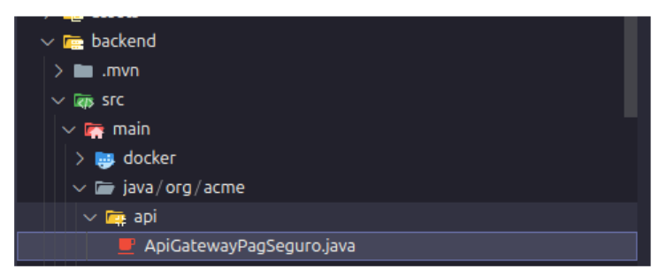  
- *Fluxo da integração com o PagSeguro*  

#### 🧪 Testes da API  
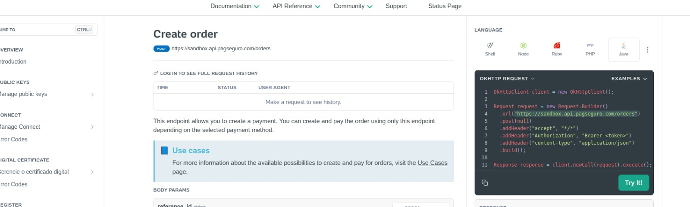  
- *Execução dos testes da API*  

#### ✅ Resposta 200 OK para Gateway  
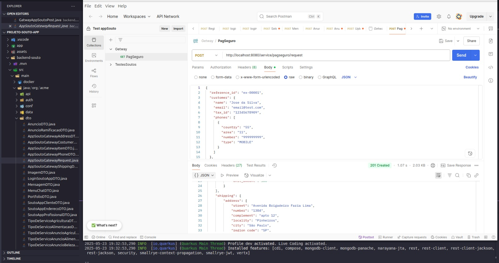  
- *API respondendo conforme esperado* 

---

## 🔐 auth/  

- Responsável pela **autenticação**, **login** e **registro** de usuários.  
- Implementado com **tokenização JWT**, garantindo segurança e separação clara de responsabilidades na lógica.  

---

##### 🔧 Lógica implementada  
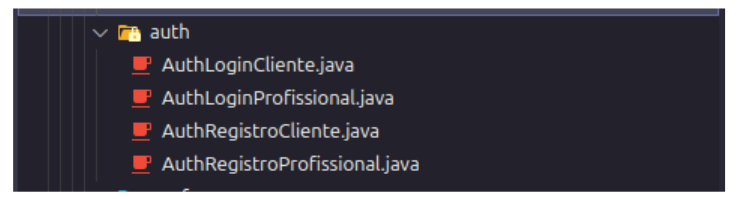  
- *Fluxo de autenticação com login, registro e geração de token JWT* 

#### ✅ Resposta 200 OK para Cliente/Profissional
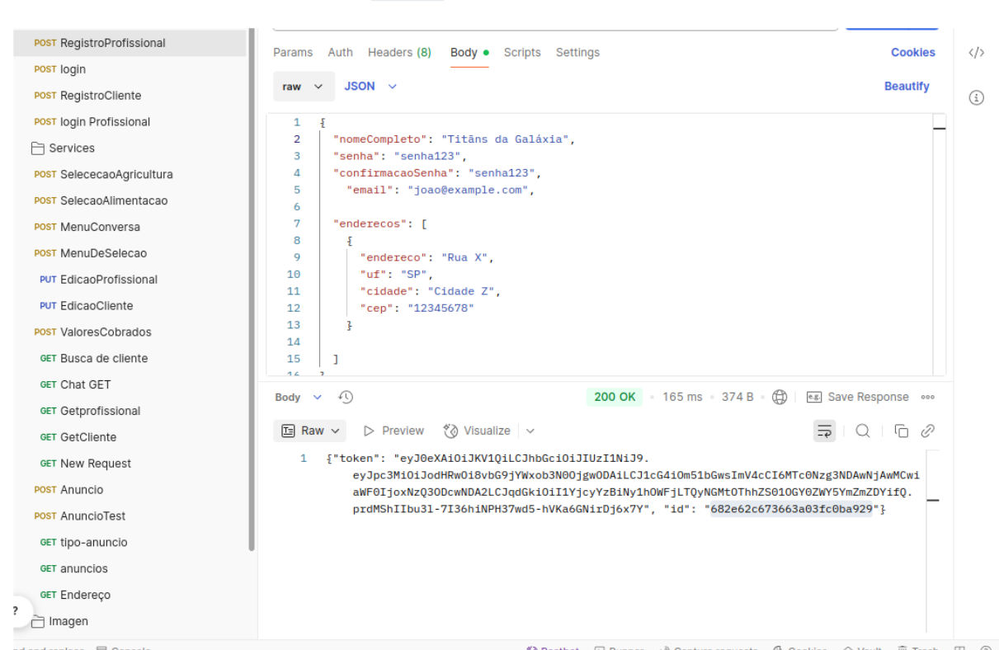
- *API auth-cliente responde conforme o esperado*

---

## ⚙️ config/

- Responsável pelas **logs customizáveis**, permitindo injeção e chamadas específicas para personalização.  
- Também responsável pela configuração de **CORS**, garantindo comunicação entre **backend** e **frontend** durante os testes utilitários.  

---

#### 📸 Representação dos arquivos de configuração (CORS + Logs)

- *Arquivos separados para uma estrutura limpa e organizada*

---

## 📨 dto/

- Responsável pela **transferência de dados** através dos **Data Transfer Objects (DTOs)**.  
- Os **DTOs** organizam a estrutura da aplicação, tornando os dados mais dinâmicos e reutilizáveis.  
- Também contribuem para uma **arquitetura mais limpa e robusta**, facilitando o crescimento e a escalabilidade do sistema. 

---

#### 📁 Arquivos DTOs  

- *Arquivos **DTOs** organizados de forma separada e estruturada, garantindo boa organização e uma escalabilidade eficaz.* 

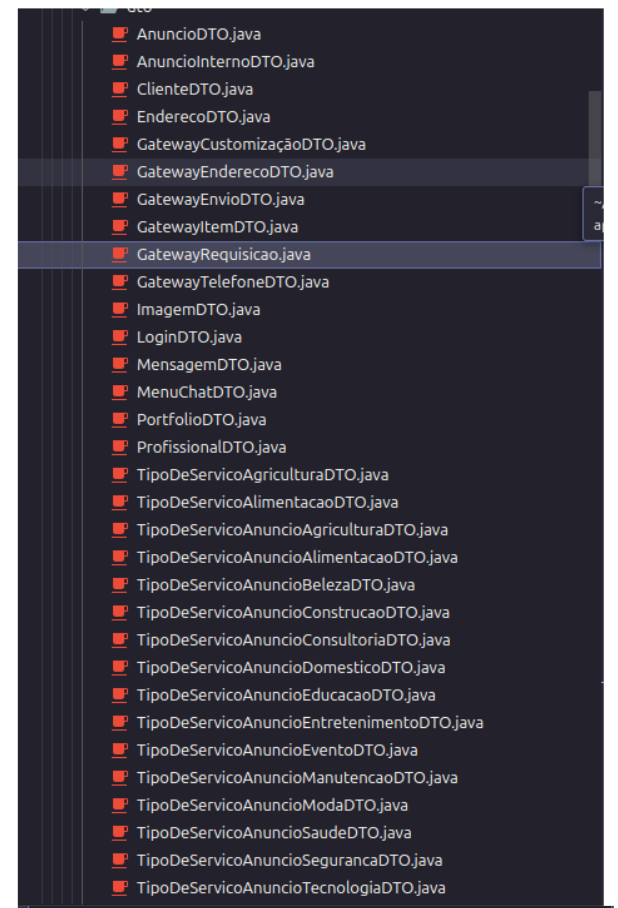

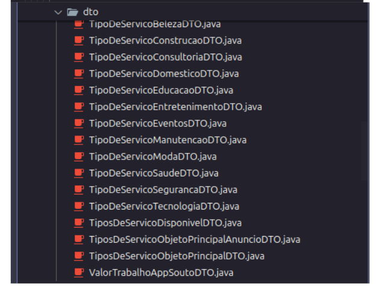

---

## 🛠️ util/  

- Responsável por centralizar as **lógicas reutilizáveis**.  
- Inclui implementações como **validação de dados**, **geração de chave JWT**, **criação de hash**, entre outras funções de suporte.

####  📁 Arquivos Utils

- *Arquivos **Utils** organizados, para uma melhor **reutilização das lógicas de negócios**.* 

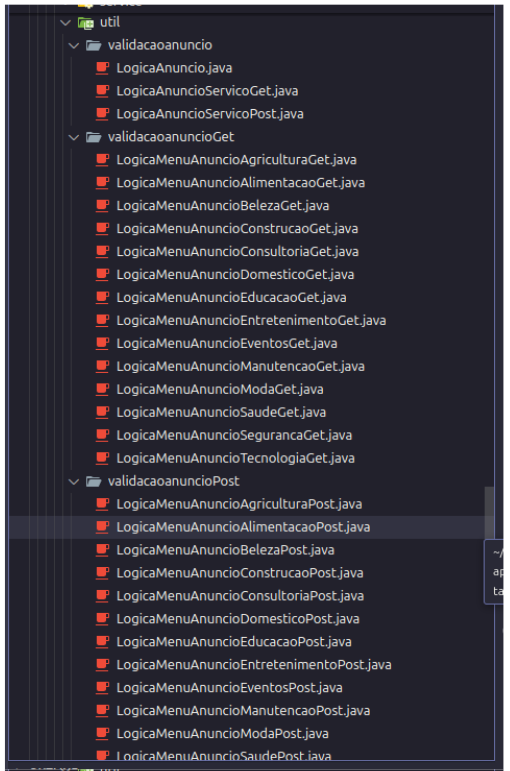

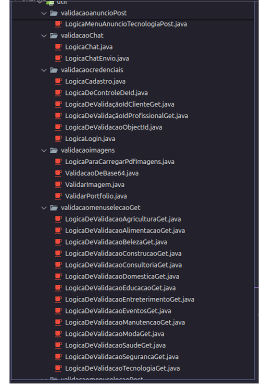

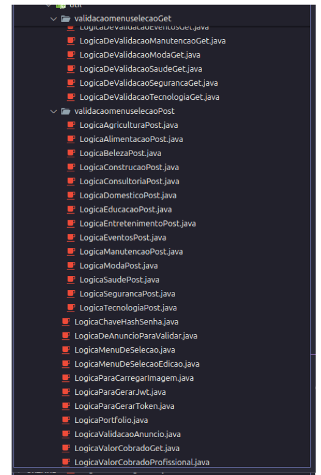

---

## 🧪 service/  

- Responsável por receber as **lógicas criadas na pasta util/** e distribuí-las conforme suas entidades ou classes.  
- Possibilita um melhor **fluxo de execução** e garante maior **escalabilidade** da aplicação.

####  📁 Arquivos Service

- *Arquivos **Service** organizados e estruturados e manter a lógica limpa e eficaz.*
- *Caso fosse adicionada a **responsabidade do Controller**, a separação continuaria garantindo clareza e eficiência.* 

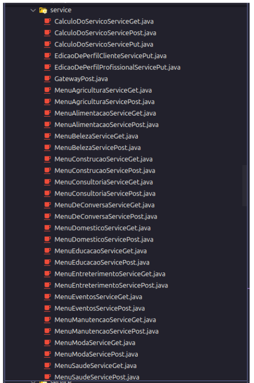

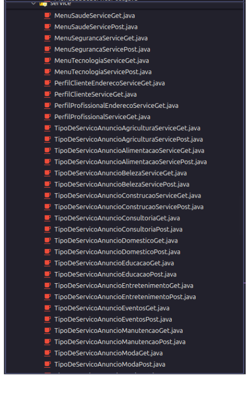