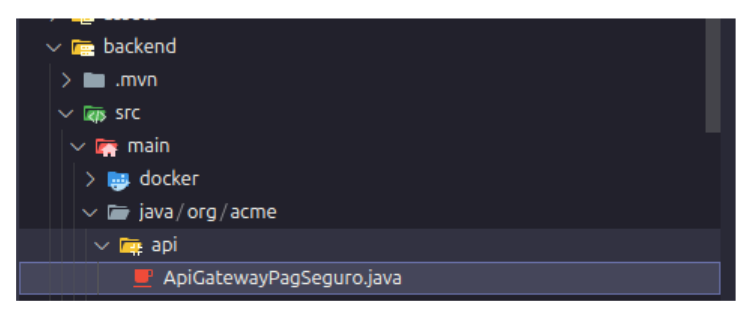

---

# ⚠️ Informações importantes ⚠️

```
Linguagem: PT-Brasil
Modo: Portfólio
Criador: Luiz Fellipe Moreschi de Lima
Descrição: Projeto foi criado, para fins, de, que o cliente pudesse ter uma plataforma de freelancer.
Esse trabalho, foi desenvolvido por mim, onde, eu tive meses de trabalho árduo como freelancer. 
Logo, essas imagens, não contem as lógicas de negócios, por ética.  
```
---

# Tecnologias utilizadas

- **Java** ➡︎ *Linguagem robusta, OOP, com foco em aplicações mais seguras e alto desempenho.*
- **Quarkus** ➡︎ *Framework Java moderno, otimizado para microsserviços e aplicações em nuvem, com foco em lógica centralizada e criação de APIs REST seguras.*
- **Docker** ➡︎ *.**Plataforma** de código aberto que permite criar, rodar e gerenciar contêineres, facilitando a implementação de aplicações de forma mais segura, portátil e eficiente na infraestrutura.*
- **MongoDB** ➡︎ *Banco de dados **NoSQL** orientado a documentos, projetado para ser flexível e escalável. Diferente dos bancos relacionais, o **MongoDB** armazena dados em coleções de documentos **JSON**, permitindo maior adaptação a diferentes tipos de aplicações.*

---

## Falando um pouco sobre o projeto

Esse projeto, foi criado para fins de assemelhar a platáformas como **99Freelas**, **Workana**, entre outras.
Foram 3 meses de desenvolvimento do backend, aplicando boas práticas de engenharia de software, como... **Layered Architeture**, **Separation of Concerns (SoC)** e **Modelling Patterns**. A construção foi feita em **Java**, usando o Quarkus como **Framework**, o **MongoDB** para armazenamento dos dados, de forma leve e facilitando a escabilidade.

---

# APIs Rest

---
### 📦 api/
- Responsável pela integração com o **gateway da PagSeguro**
- Centraliza as chamadas externas, mantendo a separação de responsabilidade

